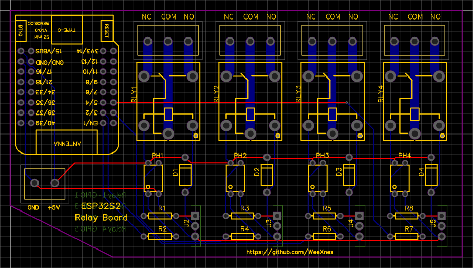

### Wemos S2 Mini 4 Channel Relay board
Components:
- Microcontroller:
  - Wemos S2 mini (original or clone boards)
- Resistors:
  - 4x 330Ω (R2, R4, R6, R7)
  - 4x 1kΩ (R1, R3, R5, R8)
- Diodes:
  - 4x 1N5819 (D1, D2, D3, D4)
- Transistors:
  - 4x TIP122 (U2, U3, U4, U5)
- Optocouplers:
  - 4x PC817C (PH1, PH2, PH3, PH4)
- Terminals:
  - 4x KF301-3P
  - 1x KF301-2P
- Relays:
  - 4x SRD-05VDC-SL-C (RLY1, RLY2, RLY3, RLY4)

### Usage:
Relays are connected to:
Relay 1: GPIO1
Relay 2: GPIO3
Relay 3: GPIO2
Relay 4: GPIO5

#### Info:
This board is working, yet i did not test if its working for 230V loads since im only using it for lower voltage loads (the relays are rated for 230V but i dont know whether the traces between terminals and relays are thick enough).
Try at your own risk